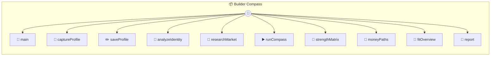

# Builder Compass

Builder Compass

> **10 tools** · API Photon · v1.16.0 · MIT

**Platform Features:** `custom-ui` `stateful` `dashboard`

## ⚙️ Configuration


| Variable | Required | Type | Description |
|----------|----------|------|-------------|
| `BUILDER_COMPASS_TINYFISHAPIKEY` | Yes | string | No description available |


## 📋 Quick Reference

| Method | Description |
|--------|-------------|
| `main` | Open the Builder Compass dashboard |
| `captureProfile` | First-step MCP capture for Builder Compass. |
| `saveProfile` | Save the builder profile that Builder Compass should reason from. |
| `analyzeIdentity` | Analyze the builder's identity, strengths, work fit, and risks |
| `researchMarket` | Research how people with this profile are making money right now |
| `runCompass` | Run the full builder compass flow end to end |
| `strengthMatrix` | Structured strengths matrix for agents and dashboards |
| `moneyPaths` | Ranked money paths for this builder profile |
| `fitOverview` | Quick visual fit panel for the dashboard |
| `report` | Full narrative guide for the user |


## 🔧 Tools


### `main`

Open the Builder Compass dashboard


---


### `captureProfile`

First-step MCP capture for Builder Compass. Use this when the client already knows some facts about the builder from memory or recent conversation. The client should: - infer and pass known facts immediately - omit fields that are still unknown - elicit only the missing high-value facts - use this as the default entry point before identity and market research. Calling this method saves or refines the stateful builder profile so the UI and later tools can continue from the same stored profile.


---


### `saveProfile`

Save the builder profile that Builder Compass should reason from. MCP clients should treat this as the canonical capture contract: infer as much as possible from memory and recent conversation, ask the user only for missing high-value fields, and pass factual signals rather than flattering summaries. IMPORTANT: - Do not ask the user to retype facts the client already knows. - Pass known fields immediately. - Omit fields that are still unknown. - If truly important fields are still missing, elicit only those. - Calling this method again should refine the saved profile, not start over. The goal is to capture the smallest truthful self-model that still supports: builder archetype classification, work-fit analysis, and market-path research.


---


### `analyzeIdentity`

Analyze the builder's identity, strengths, work fit, and risks


---


### `researchMarket`

Research how people with this profile are making money right now


---


### `runCompass`

Run the full builder compass flow end to end


---


### `strengthMatrix`

Structured strengths matrix for agents and dashboards


---


### `moneyPaths`

Ranked money paths for this builder profile


---


### `fitOverview`

Quick visual fit panel for the dashboard


---


### `report`

Full narrative guide for the user


---


## 🏗️ Architecture




## 📥 Usage

```bash
# Install from marketplace
photon add builder-compass

# Get MCP config for your client
photon info builder-compass --mcp
```

## 📦 Dependencies

No external dependencies.

---

MIT · v1.16.0
