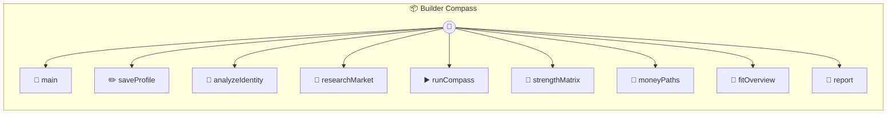

# Builder Compass

Builder Compass

> **9 tools** · API Photon · v1.16.0 · MIT

**Platform Features:** `custom-ui` `stateful` `dashboard`

## ⚙️ Configuration

No configuration required.


## 📋 Quick Reference

| Method | Description |
|--------|-------------|
| `main` | Open the Builder Compass dashboard |
| `saveProfile` | Save the builder profile and optional TinyFish API key |
| `analyzeIdentity` | Analyze the builder's identity, strengths, work fit, and risks |
| `researchMarket` | Research how people with this profile are making money right now |
| `runCompass` | Run the full builder compass flow end to end |
| `strengthMatrix` | Structured strengths matrix for agents and dashboards |
| `moneyPaths` | Ranked money paths for this builder profile |
| `fitOverview` | Quick visual fit panel for the dashboard |
| `report` | Full narrative guide for the user |


## 🔧 Tools


### `main`

Open the Builder Compass dashboard


---


### `saveProfile`

Save the builder profile and optional TinyFish API key


---


### `analyzeIdentity`

Analyze the builder's identity, strengths, work fit, and risks


---


### `researchMarket`

Research how people with this profile are making money right now


---


### `runCompass`

Run the full builder compass flow end to end


---


### `strengthMatrix`

Structured strengths matrix for agents and dashboards


---


### `moneyPaths`

Ranked money paths for this builder profile


---


### `fitOverview`

Quick visual fit panel for the dashboard


---


### `report`

Full narrative guide for the user


---


## 🏗️ Architecture




## 📥 Usage

```bash
# Install from marketplace
photon add builder-compass

# Get MCP config for your client
photon info builder-compass --mcp
```

## 📦 Dependencies

No external dependencies.

---

MIT · v1.16.0
